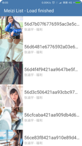

# README

[](http://www.apache.org/licenses/LICENSE-2.0.html) [](https://jitpack.io/#nekocode/kotgo) [](https://gitter.im/nekocode/kotgo?utm_source=badge&utm_medium=badge&utm_campaign=pr-badge&utm_content=badge)

## Create Template Project
You can createOrGet a new Kotgo template project fast by using the following command. Just paste and execute it at a terminal prompt. Have fun!
```bash
python -c "$(curl -fsSL https://raw.githubusercontent.com/nekocode/kotgo/master/project_creator.py)"
```
Of course, you can also download the python script to your local disk to run it. It depends on the `requests` lib.

## Description
**Kotgo** is an android development framework using **MVP** architecture, it is built entirely with **Kotlin**. There are some [related articles](http://zhuanlan.zhihu.com/kotandroid) talk about it.


### Package structure
```
cn.nekocode.kotgo.sample
├─ data
│  ├─ DO
│  ├─ repo
│  └─ service
│ 
├─ ui
│  └─ screen_one
│     ├─ Contract.kt
│     ├─ Presenter.kt
│     └─ Activity.kt
│
└─ App.kt
```

### Dependencies
- **kotlin: `1.0.5-2`**
- anko: **`0.9`**
- rxkotlin: **`0.60.0`**
- retrofit: **`2.1.0`**
- picasso: **`2.5.2`**
- paper: **`2.0.0`**
- paperparcel: **`1.0.0`**

### Sample
Thanks to **[gank.io](http://gank.io/)**. The sample app fetchs photos from it.



Another more perfect Sample: **[Murmur](https://github.com/nekocode/murmur)**

## Component Library
You can only use the kotgo's component library. It provides many useful tools to help you to build a MVP project fast and simply. Just add the JitPack repository to your root build.gradle:
```gradle
repositories {
    maven { url "https://jitpack.io" }
}
```

And then add the dependency to your sub build.gradle:
```gradle
dependencies {
    compile 'com.github.nekocode:kotgo:<lastest-version>'
}
```

### RxLifecycle & RxBus
You can bind the RxJava subscriptions into the lifecycle of the class that implements `RxLifecycle.Impl` (such as base activity, fragment and presenter). It can help you unsubscribe the `Observable` when the activity or fragment is destoried.
```kotlin
MeiziRepo.getMeizis(50, 1).safetySubscribe({
    view.refreshMeizis(it)
}, {
    // onError
})
```

And you can use `RxBus` to send events everywhere. And then subscribe them in the class that implements `RxLifecycle.Impl`

```kotlin
RxBus.send("Success")
RxBus.safetySubscribe(String::class.java, {
    showToast(it)
}, {
    // onError
})
```

### Fragment Presenter
This library uses fragment to implement presenter.
```kotlin
class MeiziPresenter(): KtPresenter<Contract.View>(), Contract.Presenter {
    override fun onViewCreated(view: Contract.View?, savedInstanceState: Bundle?) {
        view?.showToast("View created.")
    }
}
```

### Single Activity Multiple Fragments
You can build applications with only one single `KtFragmentActivity`. Then use fragment instead of activity to make pages. The `KtFragmentActivity` provides following functions to help you manage the fragment page in the stack.
```kotlin
push()
pushForResult()
popAll()
popUntil()
popTop()
pop()
startActivityForResult()
```
